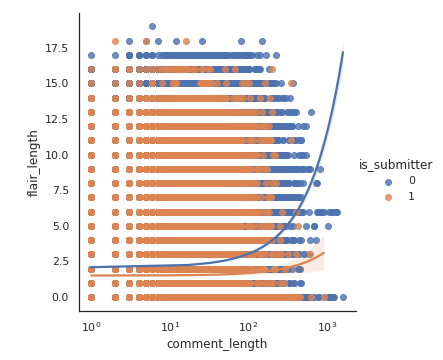
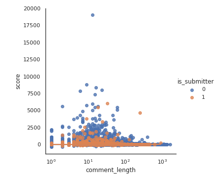
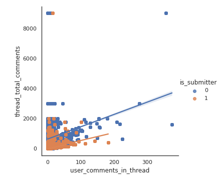
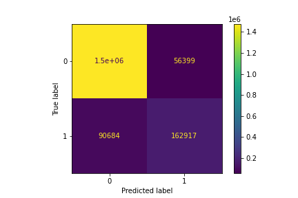
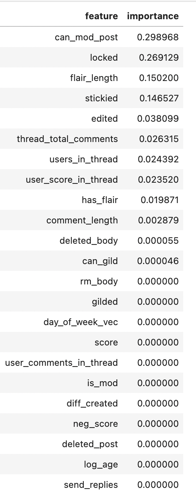

### Name: Chau Nguyen

### Table of Contents

* [Introduction](#intro)
    * [Classifier for <code>is_submitter</code>](#classifier)
        * [Imbalanced classes](#imb)
        * [Evaluation metrics](#metrics)

* [Codes](#codes)

* [Methods](#methods)
    * [Data Pre-Processing](#pp)
        * [Part 1: Exploratory data analysis](#eda)
        * [Part 2: Data cleaning](#clean)
        * [Part 3: Feature engineering](#fe)
    * [Modeling](#modeling)


* [Results](#result)
    * [Confusion Matrix](#cm)
    * [Model evaluation](#eval)
    * [Feature Importance](#fe)

* [Conclusions](#conclusions)
    * [Lessons learned](#lessons)
        * [Big data DS: Domain expertise, goals, metrics](#lessons_ds)
        * [Big data ML: Patience, cloud computing, pipeline](#lessons_ml)

    * [Things I would do differently](#diff)

# Introduction <a name = 'intro'>

In this project, I train a classifier to determine whether comments in a readdit thread were created by the original poster of the thread or not. I am using data from the subreddit <code>/r/pcmasterrace</code> to train and test my classifier. The full dataset itself contains 8,928,401 rows, thus I needed to use cloud computing to explore and clean the dataset, then train and test my model. 


## Classifier for <code>is_submitter</code> <a name='classifier'>

* In reddit threads, we can usually tell who the submitter (or OP - "Original Poster") is if they use the same account to make comments on posts they've made.

* Reddit users have the ability to switch between multiple accounts and comment on their own thread, creating fabricated interaction.

* In practice, Reddit the company may have records such as IP address and browser signature that could help them identify whether 2 accounts are indeed the same user. However, this information is not publicly available in the API.

* Therefore, I wanted to see if I could build a classifier model with SparkML to classifier whether comments in a thread were submitted by the Original Poster or not.

### Imbalanced classes <a name = 'imb'>

In the small data partition for June 2021, 34,585 out of 226,085 training samples (around 15%) have label <code>is_submitter == 1</code>. Out of 7,141,851 training records of the full data set, 1,014,861 are <code>is_submitter ==1</code>, or about 14%.  

###  Small dataset (June 2021 partitiion)

<code>is_submitter</codes>      | Count |
| ----------- | ----------- |
| 0      | 191,500       |
| 1   | 34,585        |

### Big data set - Training split

<code>is_submitter</codes>      | Count |
| ----------- | ----------- |
| 0      | 6,126,990       |
| 1   | 1,014,861       |


I did not look at the test samples in either the small nor big samples to prevent personal biases and data leakage. However, both these ratios tell me that I have an **imbalanced classifier** to model.

### Evaluation metrics <a name = 'metrics'>

Only 14-15% of comments in my reddit dataset were written by the original poster of the thread, I needed an evaluation metric that is NOT accuracy of the overall classifier. This is because a model can classifier that ALL of all the comments in my data were not written by the original poster (<code>is_submitter==0</code>) and be accurate 85% of the time. 

To evaluate a classifier's performance in an imbalanced dataset, I should focus on:

* Precision (TP = TP + FP or what % of all the comments the classifier said were written by the OP were actually written by the OP)

* Recall (TP = TP + FN or what % of all the comments written by OPs did the classifier get correctly)

Which of these 2 prioritize depends on the ideal outcome - or what I want the classifier to accomplish. 

*  For example, if my use case is to catch (and ban) submitters who use multiple accounts to comment on the same thread, then I want to prioritize recall.

*  However, I don't want to completely abandon precision either, because an auto-ban-classifier with low precision will cause legitimate, single-account users undue annoyance of wrongly getting banned, which is not good.

* This is why the F1-score, or the harmonic mean of precision & recall is another popular evaluation metric for imbalanced classes.

What if I want to take both precision and recall into consideration, but prioritize recall a little more than precision so that I can catch more multi-account commenters while minimizing false bans on single-account users? I can calculate the F-2 score by setting the <code>beta</code> parameter of SparkML's <code>MulticlassClassificationEvaluator</code> equal to 2, which tells the classifier to prioritize recall over precision but not ignore it altogether.

## Codes <a name = 'codes'>

There are 4 main notebooks I used for the project:

* <code>small_EDA</code> to create simple visualizations and print out some basic statistics about the June 2021 partrition of my data.

* <code>small_GBT</code> the end-to-end pipeline to clean and train a Gradient Boosted Tree model on the June 2021 data to confirm that my code works.

* <code>big_GBT</code> almost identical to <code>small_GBT</code>, except that I read in all 8 millions+ rows from the full reddit dataset to train and save a model.

* <code>big_eval</code> I load the fully trained model and examine evaluation metrics


## Methods: <a name = 'methods'>

### Part 1: Exploratory data analysis <a name = 'eda'>

##### Step 1: Making sense of features from the reddit comments dataset.

* I am a frequent reddit user, therefore I had some familiarity with how a reddit comment threads are structured, what the upvote/ downvote system is, what comment collapsing means, how flairs generally work, etc.

##### Step 2: Gaining *domain expertise* on /r/pcmasterrace

* However, prior to this project, I was not a follower of the /r/pcmasterrace subreddit, I did not have the *domain knowledge* to understand the above features of this particular subreddit for the following reasons:

    * Different subreddits have their own sets of rules enforced by their own moderators. For example, in some subreddits, only subscribers are allowed to comment, upvote or downvote certain posts. In other subreddits, new accounts or accounts with fewer than a pre-definded threshold of karma score cannot create post of comments. Thus, I cannot apply my previous "domain knowledge" as a user of other subreddits to /r/pcmasterrace without learning more about it. 

    * Thus, aside from looking at columns from the dataset in Spark, I browsed the subreddit to get a sense for contents posted on it and the type of interaction between users.

##### Step 3: Exploratory data analysis: SparkSQL + pySpark + pandas + seaborn
    
Because I was not familiar with the subreddit itself, I did not want to come up with a hypothesis to test or a what kind of supervised model to build until I saw what the data looks like. I spent a lot of time working exploring the June 2021 parquet of the data, which has about 300k rows.

SparkSQL was extremely helpful for summary statistics, count and aggregates of the June dataset. For example, if I wanted to see how many posts (<code>id</code>) a unique user (<code>author</code>) have made in a thread (<code>link_id</code>), I would run the follow command:

```
spark.sql(
    '''
    SELECT DISTINCT link_id, author, COUNT(id) as post_count
    FROM df
    GROUP BY link_id, author
    ORDER BY post_count desc
    LIMIT 10;
    '''
).show(truncate=False)
```
SparkSQL was quite fast and sufficient if I wanted to understand how certain rows and columns could potentitally be grouped together or to get an idea of what's inside a long text string.

Although SQL aggegate tables are really helpful, but as a visual learner, I also needed to "see" the data. For quick visualization, my pipeline is:
* Use pySpark <code>withColumn()</code> method to quickly create a new variable in my Spark DataFrame
* Use <code>createOrReplaceTempView</code> method to create a temp table that has this new variable
* Use sparkSQL to <code>SELECT</code> this new variable, along with other variables and aggregates I want to visualize with
* Use <code>toPandas()</code> method to convert the aggregated sparkSQL table (now much smaller than the original) into a much smaller pandas dataframe.

* As I have more experience with pandas, matplotlib and seaborn than I do SparkSQL and pySpark, I could make quick data visualizations.

* I chose to use pySpark <code>withColumn()</code> to create new features, then selecting them from SparkSQL and converting the table back into pandas for visualizations instead of writing queries inside SparkSQL directly for **reproduction** purposes, because if the feature looks interesting, it could be part of my Data Cleaning & Feature Engineering pipelines right away.


### Part 2: Data Cleaning  <a name='clean'>

 I did some data cleaning as I was exploring the data. I  decided early on in the process that there were complicated variables that I had to sacrifice, such as those related to <code>awards</code> and <code>author_flair</code>. I also dropped redundant columns such as <code>subreddit_id</code> -  my dataset only consisted of comments from /r/pcmasterrace)

I did some standard cleaning steps such as converting unix time in seconds into UTC timestamps, date, and time. The code is codmmented. 

### Part 3: Feature Engineering <a name ='fe'>

I also calculated new features, such as the length of a user's flair, the length of a comment, account age by the time a comment was posted, the total number of posts a unique user made in a certain thread, the day of week (on UTC) a comment was made.

Below are some visualizations of the newly created features in the June 2021 partition of the data. I was not able to re-create these visualizations using the full dataset. 







## Modeling

* After getting visual confirmation that there is a difference between the behavior of a thread's submitter, I began building my classifier model.

* Because the original dataset has more than 8 million rows, I first built my model on the small June 2021 partition, and the F-2 score is my North Star metrics.

* The F-2 score: by setting the <code>beta</code> parameter of SparkML's <code>MulticlassClassificationEvaluator</code> equal to 2, I could use the F2-score as the evaluator's metric in the cross validation process. 

* I picked SparkML's <code>Gradient Boosted Tree</code> as my classifier model. Initially, I also tried a <code>Random Forest Classifier</code>, but I found that I could not get good results for the recall score, so I decided to stick with GBT in the end. My research shows that GBT has a tendency to overfit, and to combat that I added a layer of cross-validation in the model training pipeline


* Cross-validation: I set both small_ML and big_ML to do 5 folds of cross validation, which means that 20% of the training data will be used as a validation set in for each of the 5 cross-validation runs. In the interest of time, I only tuned 1 paramater, <code>stepSize</code>, which is the learning rate of the classifier. 

* After I confirmed that my code could run successfully on the June 2021 partition, I trained a similar model on the large dataset. I discuss the results below.

## Results <a name = 'res'>

### Confusion matrices <a name = 'cm'>

I created the confusion matrices for the classifier. The confusion matrix once again shows that my model did really well in finding True Positives of the <code>is_submitter</code> class, despite the obvious imbalance between my 2 classes. In the next section, I re-confirmed this by checking evaluation metrics of the model.

#### On training set


#### On test set



### Model evaluation <a name = 'eval'>

* The GBT Classifier performed exceptionally well, according to the metrics I set out above. On both training and test set, I managed to get the F-2 score to 0.916. The weighted precision and recall were both higher thatn 0.91 as well.

|                    | Training                   | Test                 |
| -----------        | -----------                | -----------          |
| Size               | 7,141,851                  | 1,786,550            |
| F-2 score          | 0.9166694881225047         | 0.9166360866758878   |
| Weighted Precision | 0.9139830811708024         | 0.9139501467818495   |
| Weighted Recall    | 0.9178316616138902         | 0.9177957662474188   |

Out of curiosity, I wanted to evaluate the F-1 score, unweighted precision and unweighted recall. Although the F-1 score was still quite high, the unweighted precision and un-weighted recall score dropped.

|                       | Training                   | Test                 |
| -----------           | -----------                | -----------          |
| Size                  | 7,141,851                  | 1,786,550            |
| F-1 score             | 0.9152723705182283         | 0.9244899814995238   |
| Un-weighted Precision | 0.7442854434961735         | 0.7751304102636402   |
| Un-weighted Recall    | 0.6423584762482926         | 0.6390793909101476   |

### Feature Importance <a name = 'fe'>

Finally, as the GBT classifier is tree-based, I was able to get a list of feature importance for my model thanks to SparkML without needing to rerun it to compute permutation importance. The list of features ordered by their "importance" in my classifier is displayed below.



Only some of the features I "engineered" were important features of the model. If I had more time, I would have re-ran the model with only these features to see if it does as well as the full feature set, but unfortunately I did not. This would be interesting to revisit in the future.


# Conclusions <a name = 'conclusions'>

## Lessons learned <a name = 'lessons'>

### Big data DS: Domain expertise, goals, metrics <a name = 'lessons_ds'>

* Knowing that I needed to an imbalanced classifier was only the first step. Actually building it was the difficult task. 

* I think picking the F-2 score as my mesure of success early on was key to creating my model, because I was able to create hypotheses about existing features and new features that could add to the pipeline.

### Big data ML: Patience, cloud computing, pipeline <a name ='lessons_ml'>

* Cloud computing is time consuming - on some occasions it took me more than 40 minutes to create and ssh into my cluster.

* It was very difficult to do adhoc adjustments and calculations with a big dataset even with cloud computing, so I needed to plan things out ahead of time.

* Extremely important to have a working script on a smaller dataset before trying anything "big data".

## Things I would do differently <a name = 'diff'>

Looking back, here are things I would have done differently:

* Picked a subreddit that I am more familiar with, so my "domain expertise" was not lost.

    * With a subreddit that I had more background knowledge of, I could have spent more time on feature engineering.

    * For example: in /r/cfb (College Football subreddit), users can have up to 2 flairs, usually 2 different college football teams. Because of historical rilvaries in the sport, user interaction based on school flairs are quite interesting. 

* Created a better pipeline. Because this was my first time working with pySpark, all my data cleaning and modeling were done in separate notebooks. I had to copy & paste cells around when I worked on different tasks on the different datasets, which was not great for version controlling, admittedly.

    * If I had more time, I would have writen 3 .py scripts, each with custom, callable functions:
            1) clean.py
            2) EDA.py
            3) ML.py
   
    * Afterwards, I would read these functions into 2  separate Jupyter Notebooks: small.ipynb to run & display results using the smaller partition of the data & refine the 3 py scripts; big.ipynb for one final run.

* Done additional data pre-processing, such as scaling and/ or normalizing the continuous variables. This was not necessarily for the particular model I chose because Gradient Boosted Trees are tree-based and therefor does not require feature scaling, but if I wanted to trained more than 1 type of classifier, I should keep this in the back of my head.

* Trained more than 1 classifers and done more hyper-parameter tuning. 

* Tried different under/ oversampling methods to see if I could improve the classifier. Gradient Boosted Tree performed exceptionally in my unbalanced data set, but I would have liked to see how others did as well.  


